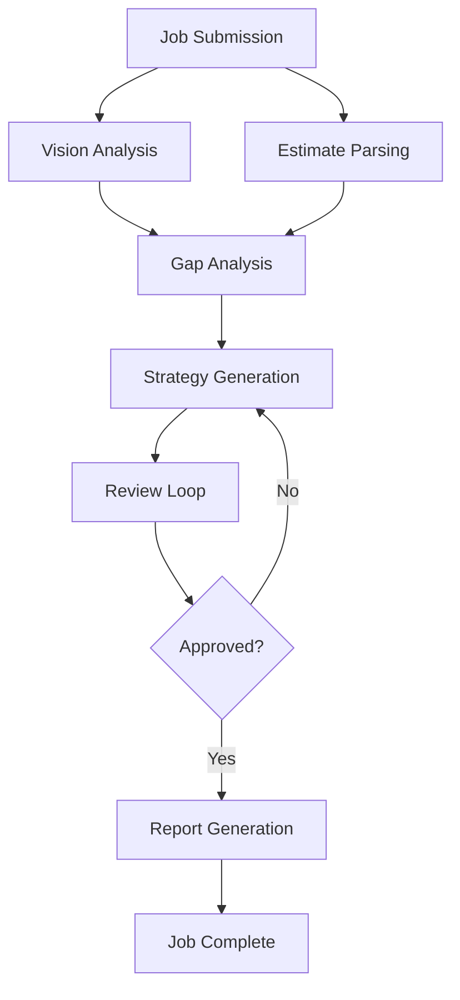
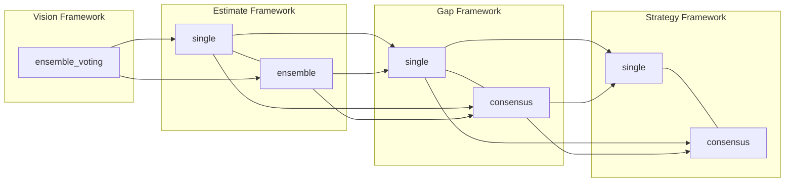
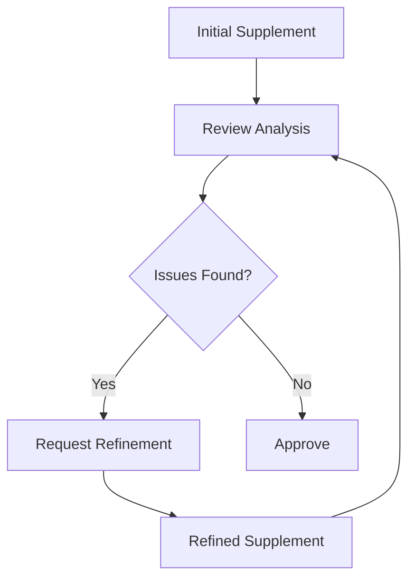
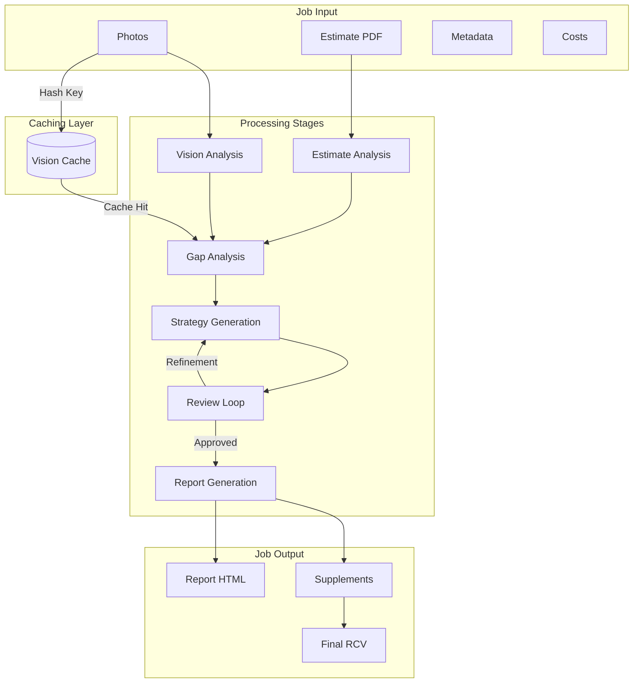

# Insurance Supplementation Agent System

A multi-agent AI system that automates roofing insurance supplement generation by analyzing photos, parsing estimates, identifying coverage gaps, and producing carrier-ready supplement packages.

## Features

- **Vision Analysis**: AI-powered detection of roofing components and damage from photos
- **Estimate Parsing**: Automatic extraction of line items from any estimate format (Xactimate, Symbility, etc.)
- **Gap Analysis**: Cross-references visual evidence against estimate coverage
- **Supplement Strategy**: Generates defensible supplements with code citations and justifications
- **Review Loop**: Self-critiquing review cycle with automatic refinement
- **Report Generation**: Professional HTML/PDF reports ready for carrier submission
- **REST API**: Full-featured API for integration with existing systems

## Quick Start

### Prerequisites

- Python 3.11+
- [uv](https://github.com/astral-sh/uv) package manager

### Installation

```bash
# Clone the repository
git clone https://github.com/zaycruz/ins-sup-agent.git
cd ins-sup-agent

# Install dependencies
uv sync

# Copy environment configuration
cp .env.example .env

# Edit .env with your API keys
# LLM_PROVIDER=openai
# OPENAI_API_KEY=sk-your-key-here
```

### Running the Server

```bash
# Development mode with auto-reload
uv run python main.py

# Or using uvicorn directly
uv run uvicorn src.api.app:app --host 0.0.0.0 --port 8000 --reload
```

The API will be available at `http://localhost:8000` with documentation at `http://localhost:8000/v1/docs`.

### Submit Your First Job

```bash
curl -X POST http://localhost:8000/v1/jobs \
  -F "estimate_pdf=@estimate.pdf" \
  -F "photos=@photo1.jpg" \
  -F "photos=@photo2.jpg" \
  -F 'metadata={"carrier":"State Farm","claim_number":"CLM-123","insured_name":"John Doe","property_address":"123 Main St"}' \
  -F 'costs={"materials_cost":5000,"labor_cost":8000}'
```

## Architecture

### High-Level System Flow



### Framework Configurations

The system supports configurable frameworks at each stage, enabling ablation studies and optimization:



### Framework Types

| Stage | Type | Description |
|-------|------|-------------|
| **Vision** | `ensemble_voting` | Uses multiple vision models with voting mechanism to combine results |
| **Estimate** | `single` | Single LLM parses estimate |
| **Estimate** | `ensemble` | Multiple LLMs parse estimate, results aggregated |
| **Gap** | `single` | Single LLM identifies coverage gaps |
| **Gap** | `consensus` | Multiple LLMs identify gaps, merged with confidence scoring |
| **Strategy** | `single` | Single LLM generates supplement strategy |
| **Strategy** | `consensus` | Multiple LLMs generate strategies, merged with confidence scoring |

### Configuration Naming

Configurations are named using the format: `v:{vision}/e:{estimate}/g:{gap}/s:{strategy}`

Example: `v:ensemble_voting/e:single/g:single/s:consensus`

## Agent Pipeline

| Agent | Purpose | Framework Options |
|-------|---------|-------------------|
| **Vision Agent** | Analyzes photos to detect roofing components and damage | ensemble_voting |
| **Estimate Agent** | Parses insurance estimate PDF into structured line items | single, ensemble |
| **Gap Analysis Agent** | Identifies discrepancies between evidence and estimate | single, consensus |
| **Strategist Agent** | Converts gaps into defensible supplement proposals | single, consensus |
| **Review Agent** | Self-critiques and requests refinements | Built-in review loop |
| **Report Agent** | Generates carrier-ready HTML/PDF reports | Toggleable via API |

### Review Loop



The review loop continues until:
- All issues are resolved
- Maximum iterations reached (configurable)
- Job is manually approved/escalated

## Benchmark Results

Based on testing with the Clarivel Perez test case (Ground Truth Supplement: $12,542.46):

### Configuration Performance Comparison

| Framework Config | F1 Score | MAE | MAPE | Consistency |
|-----------------|----------|-----|------|-------------|
| v:ensemble_voting/e:single/g:single/s:single | **48.6%** | $5,398 | 43.0% | 77.5% |
| v:ensemble_voting/e:single/g:consensus/s:single | 44.8% | $5,248 | 41.8% | 67.4% |
| v:ensemble_voting/e:ensemble/g:single/s:consensus | 44.7% | $3,588 | 28.6% | 69.8% |
| v:ensemble_voting/e:ensemble/g:single/s:single | 43.0% | $4,890 | 39.0% | 98.6% |
| v:ensemble_voting/e:single/g:single/s:consensus | 37.6% | **$2,791** | 22.2% | 76.6% |
| v:ensemble_voting/e:ensemble/g:consensus/s:consensus | 35.6% | $10,822 | 86.3% | 45.1% |
| v:ensemble_voting/e:single/g:consensus/s:consensus | 31.2% | $3,314 | 26.4% | 69.7% |
| v:ensemble_voting/e:ensemble/g:consensus/s:single | 19.0% | $9,438 | 75.2% | -41.4% |

### Key Findings

**Best F1 Score:** `v:ensemble_voting/e:single/g:single/s:single` at 48.6%

**Best MAE:** `v:ensemble_voting/e:single/g:single/s:consensus` at $2,791

### Role-Level Aggregates

| Stage | Single Avg F1 | Ensemble/Consensus Avg F1 | Winner |
|-------|--------------|--------------------------|--------|
| Estimate | 40.6% | 35.6% | **Single (+5.0%)** |
| Gap | 43.5% | 32.7% | **Single (+10.8%)** |
| Strategy | 38.9% | 37.3% | **Single (+1.6%)** |

### Insights

1. **Single frameworks outperform ensemble variants** at the Estimate and Gap stages
2. **Consensus merging can hurt performance** when the threshold drops valid supplements
3. **Best F1 and MAE configurations differ** - trade-off between accuracy and consistency
4. The `v:ensemble_voting/e:single/g:single/s:single` configuration offers the best balance of F1 and consistency

## Information Flow



### Key Technical Features

1. **Vision Output Caching**: Photo analysis results are cached using SHA256 hash of (framework + photo bytes), eliminating redundant LLM calls across benchmark iterations

2. **Validation Repair**: When LLM responses fail Pydantic validation, the system automatically:
   - Captures the validation error
   - Requests LLM to repair the response
   - Retries parsing with corrected data

3. **Report Toggle**: Report generation can be disabled via API (`generate_report=false`) for faster benchmarking

4. **Framework Persistence**: Framework configurations persist in the job's `result` JSONB field, enabling consistent reprocessing

## API Endpoints

| Method | Endpoint | Description |
|--------|----------|-------------|
| `POST` | `/v1/jobs` | Submit a new supplementation job |
| `GET` | `/v1/jobs` | List jobs with filtering |
| `GET` | `/v1/jobs/{id}` | Get job status and results |
| `GET` | `/v1/jobs/{id}/report` | Download generated report |
| `POST` | `/v1/jobs/{id}/approve` | Approve an escalated job |
| `POST` | `/v1/jobs/{id}/reject` | Reject an escalated job |
| `DELETE` | `/v1/jobs/{id}` | Cancel a pending job |
| `GET` | `/health` | Health check |

See [docs/API.md](docs/API.md) for complete API documentation.

## Configuration

Configuration is managed through environment variables. See `.env.example` for all options.

### Key Settings

| Variable | Default | Description |
|----------|---------|-------------|
| `LLM_PROVIDER` | `mock` | LLM provider: `openai`, `anthropic`, or `mock` |
| `OPENAI_API_KEY` | - | OpenAI API key |
| `ANTHROPIC_API_KEY` | - | Anthropic API key |
| `VISION_MODEL` | `gpt-4o` | Model for vision analysis |
| `TEXT_MODEL` | `gpt-4o` | Model for text processing |
| `DEFAULT_MARGIN_TARGET` | `0.33` | Default profit margin target (33%) |
| `API_PORT` | `8000` | API server port |

## Project Structure

```
ins-sup-agent/
├── src/
│   ├── agents/          # Agent implementations
│   │   ├── base.py      # Base agent class with validation repair
│   │   ├── text_frameworks.py    # Framework implementations
│   │   ├── gap_analysis.py       # Gap analysis with repair
│   │   └── strategist.py         # Strategy generation with repair
│   ├── api/             # FastAPI application
│   │   ├── app.py       # Main API application
│   │   ├── routes/      # API route handlers
│   │   └── store.py     # Job persistence
│   ├── llm/             # LLM client abstractions
│   ├── orchestrator/    # Pipeline orchestration
│   │   └── core.py      # Main orchestrator with caching
│   ├── prompts/         # Agent system prompts
│   ├── schemas/         # Pydantic data models
│   │   ├── job.py       # Job schema with framework config
│   │   ├── supplements.py  # Supplement strategy models
│   │   └── review.py    # Review models
│   ├── tools/           # Agent tools (code lookup, examples)
│   └── utils/           # Utilities (PDF extraction)
├── tests/
│   ├── benchmark.py           # Benchmark harness
│   └── benchmark_all_frameworks.py  # Full framework comparison
├── docs/                # Documentation
├── main.py              # Entry point
├── pyproject.toml       # Dependencies
└── .env.example         # Environment template
```

## Development

### Running Tests

```bash
uv run pytest
```

### Code Formatting

```bash
uv run ruff format src/
uv run ruff check src/ --fix
```

### Type Checking

```bash
uv run mypy src/
```

### Running Benchmarks

```bash
# Run full framework comparison
uv run python tests/benchmark_all_frameworks.py <iterations> <jobs_per_config>

# Example: 3 iterations, 25 jobs per config
uv run python tests/benchmark_all_frameworks.py 3 25
```

## Documentation

- [API Reference](docs/API.md)
- [Architecture Guide](docs/ARCHITECTURE.md)
- [Agent Details](docs/AGENTS.md)
- [Deployment Guide](docs/DEPLOYMENT.md)

## License

MIT License - see LICENSE file for details.
